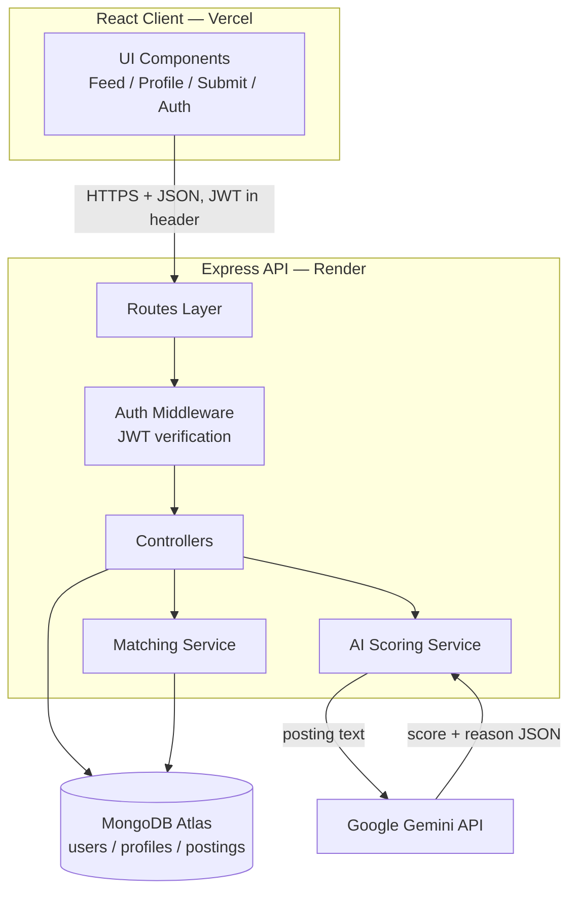
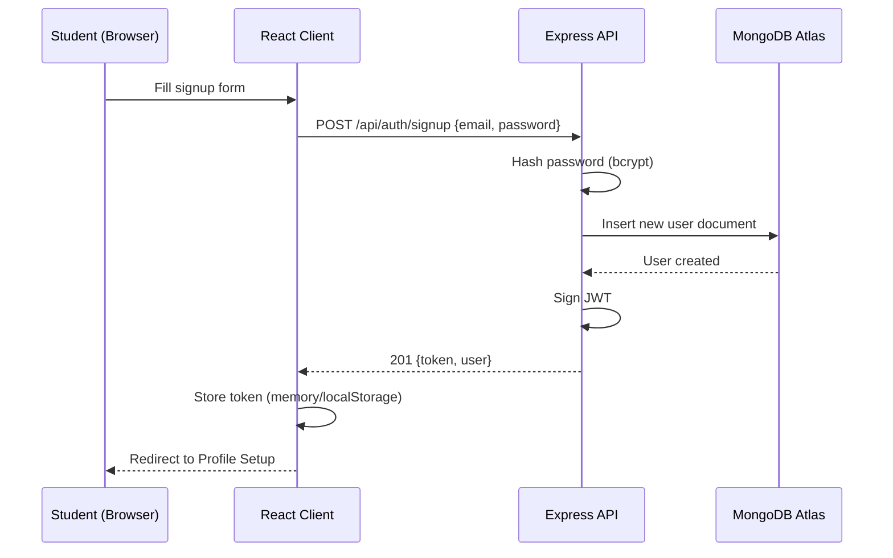
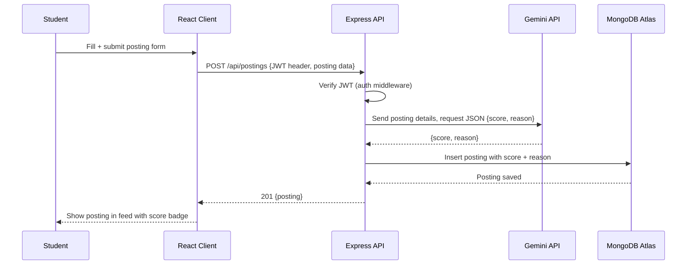
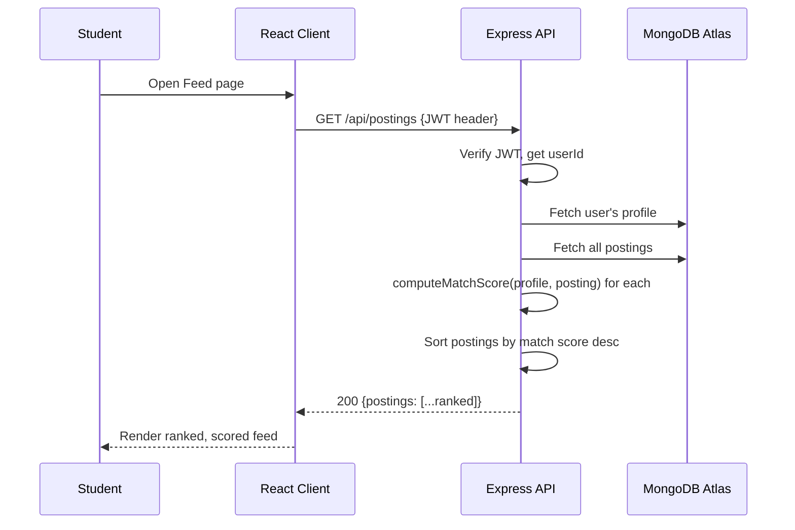

# ARCHITECTURE.md — InternTrust

## Tech Stack (Locked Day 2)

| Layer | Choice | Why |
|---|---|---|
| Frontend | React (Vite) | Fast dev server, minimal config, prior React experience |
| Backend | Node.js + Express | One language end-to-end, proves real full-stack ownership |
| Database | MongoDB Atlas (free tier) | Flexible schema for skill arrays, free forever tier |
| Auth | Custom JWT (Express + bcrypt + jsonwebtoken) | Free, no vendor lock-in, demonstrates real auth implementation |
| AI | Google Gemini API (free tier) | Genuine free tier, supports structured JSON output |
| Hosting | Vercel (frontend) + Render (backend) | Both free, auto-deploy from GitHub |
| Other libs | mongoose, cors, dotenv, axios, react-router-dom | Standard, free, well-documented |

## Component Diagram

## Data Flow — Signup & Login

## Data Flow — Submit Posting (with AI Scoring)

**Implementation decision (locked Day 2):** scoring runs **synchronously** on submit (call AI, wait for response, then save). Simpler to build and test than an async/pending-then-update flow, and demo-scale posting volume won't expose performance issues.

## Data Flow — Fetch Ranked Feed

## External Services

- **MongoDB Atlas** — persistent storage (free tier, 512MB)
- **Google Gemini API** — legitimacy scoring (free tier)
- **Render** — backend hosting (free web service, auto-deploy from GitHub)
- **Vercel** — frontend hosting (free, auto-deploy from GitHub)
