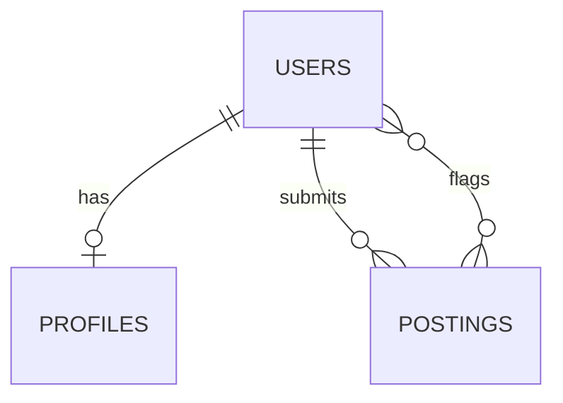

# SCHEMA.md — InternTrust Database Design

Database: MongoDB Atlas (free tier). ODM: Mongoose.

## Collections

### `users`
| Field | Type | Notes |
|---|---|---|
| `_id` | ObjectId | Auto |
| `email` | String | Unique, required |
| `passwordHash` | String | bcrypt hash, required |
| `createdAt` | Date | Default now |

### `profiles` (1:1 with `users`)
| Field | Type | Notes |
|---|---|---|
| `_id` | ObjectId | Auto |
| `userId` | ObjectId (ref: users) | Required, unique |
| `name` | String | Required |
| `skills` | [String] | Required, min 1 |
| `experienceLevel` | String enum: `fresher`, `0-1yr` | Required |
| `locationPref` | String enum: `remote`, `onsite`, `either` | Required |
| `domainInterest` | String | Optional, default `"CS/General"` |
| `updatedAt` | Date | Default now |

### `postings`
| Field | Type | Notes |
|---|---|---|
| `_id` | ObjectId | Auto |
| `title` | String | Required |
| `company` | String | Required |
| `description` | String | Required |
| `requiredSkills` | [String] | Required, min 1 |
| `stipend` | String | Optional |
| `location` | String | Required |
| `applyLink` | String | Required, URL format |
| `submittedBy` | ObjectId (ref: users) | Required; `"seed"` for founder-seeded data |
| `legitimacyScore` | Number (0–100) | Set by AI, default null until scored |
| `legitimacyReason` | String | Set by AI |
| `flaggedBy` | [ObjectId] (ref: users) | Empty array by default |
| `createdAt` | Date | Default now |

## Relationships

## Validation Against PRD User Stories

| # | User Story | Covered By |
|---|---|---|
| 1 | Create profile with skills/experience | `profiles` collection, linked via `userId` |
| 2 | Browse feed with legitimacy score | `postings.legitimacyScore` + `legitimacyReason` |
| 3 | See postings ranked by match | Computed at query time from `profiles.skills` vs `postings.requiredSkills` (not stored — always fresh) |
| 4 | Submit a posting | `postings` collection, `submittedBy` field |
| 5 | Flag a suspicious posting | `postings.flaggedBy` array |

All five PRD user stories map cleanly to this schema — no gaps found on review.
