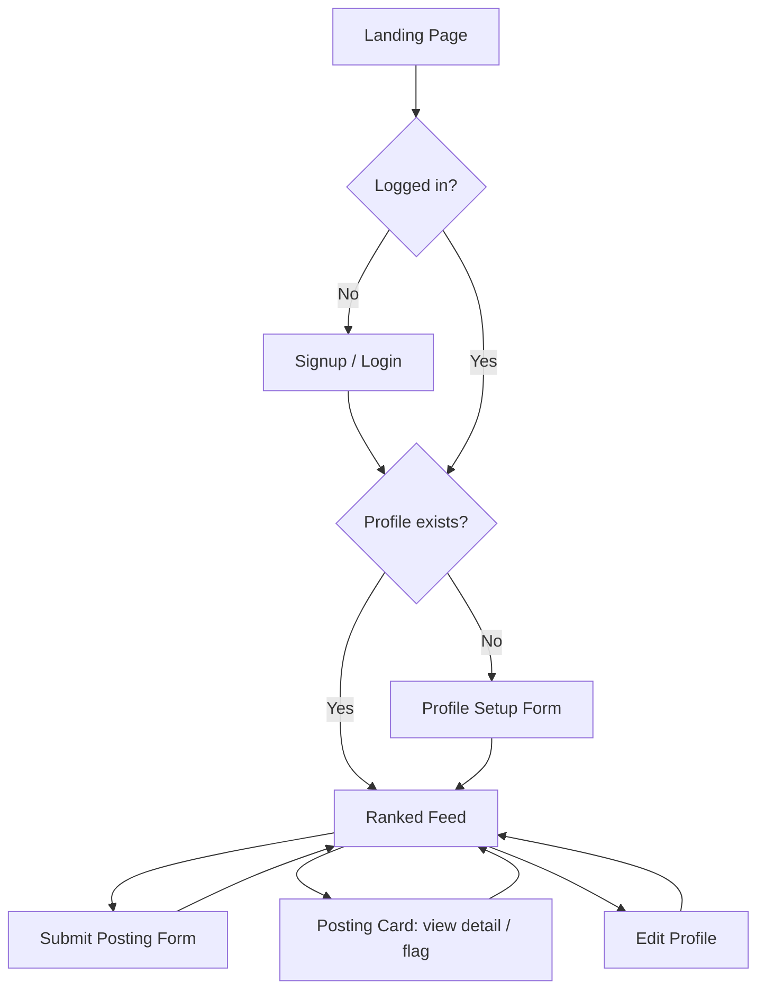

# UI-WIREFRAMES.md — InternTrust

## User Flow Diagram



## Screens (each exists for a specific reason)

1. **Landing** — entry point, explains what InternTrust is, links to Signup/Login
2. **Signup / Login** — auth entry
3. **Profile Setup / Edit** — captures skills, experience, preferences (used for matching)
4. **Feed** — the core screen: ranked, scored postings
5. **Submit Posting** — form for sharing a new internship
6. **Posting Detail (expandable card)** — full description + flag action

## Low-Fidelity Wireframes

```
[Landing]                          [Signup/Login]
+----------------------------+     +----------------------------+
| InternTrust                |     | InternTrust                |
| Tagline text                |     | [ Email            ]       |
|                              |     | [ Password         ]       |
|   [ Get Started ]           |     | [   Log In / Sign Up   ]   |
+----------------------------+     +----------------------------+

[Profile Setup]                    [Feed]
+----------------------------+     +----------------------------------+
| Build your profile          |     | Nav: Feed | Submit | Profile |Out|
| Name: [______]              |     +----------------------------------+
| Skills: [tag][tag][+add]    |     | [Score:87] Title @ Company        |
| Experience: (o) Fresher      |     | Matches: React, Node   [Flag]     |
|             ( ) 0-1 yr       |     +------------------------------+   |
| Location: (o)Remote ()Onsite|     | [Score:42] Title @ Company        |
|             ()Either          |     | Matches: Python        [Flag]     |
| [   Save Profile   ]        |     +----------------------------------+
+----------------------------+

[Submit Posting]
+----------------------------------+
| Title:        [______________]   |
| Company:      [______________]   |
| Description:  [______________]   |
| Required Skills: [tag][+add]      |
| Stipend:      [______________]   |
| Location:     [______________]   |
| Apply Link:   [______________]   |
| [       Submit Posting       ]   |
+----------------------------------+
```

## Navigation

A persistent top navbar (Feed / Submit Posting / Profile / Logout) appears on every authenticated screen — no dead ends, every screen reachable in one click.
